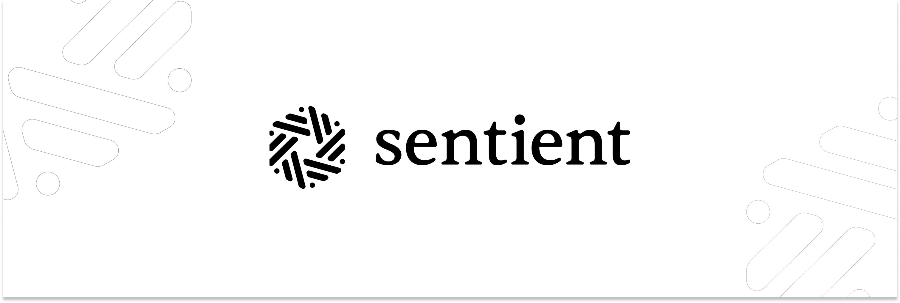

<!-- Sentient Banner -->
<p align="center">
  
</p>

<!-- Socials -->
<p align="center">
      <a href="https://sentient.xyz/" target="_blank" style="margin: 2px;">
    
  </a>
    <!-- Twitter -->
    <a href="https://x.com/SentientAGI">
        
    </a>
    <!-- Discord -->
    <a href="https://discord.gg/sentientfoundation">
        
    </a>
    <!-- Hugging face -->
    <a href="https://huggingface.co/Sentientagi">
        
    </a>
</p>

<!-- Github Repo Info -->
<p align="center">
    <!-- Release -->
    <a href="https://github.com/sentient-agi/Sentient-Agent-Framework-Examples/releases">
        
    </a>
    <!-- License -->
    <a href="https://github.com/sentient-agi/Sentient-Agent-Framework-Examples/tree/main?tab=Apache-2.0-1-ov-file">
        
    </a>
</p>


<h1 align="center">Sentient Agent Framework Examples</h1>

> [!WARNING]
> **These agents are for demonstration purposes only and are not suitable for production use.**

In addition to supporting OpenAI API compatible agents, Sentient Chat supports a custom, open source event system for agent responses. These events can be rendered in Sentient Chat to provide a richer user experience. This particularly useful for streaming responses from an AI agent, when you might want to show the agent's work while the response is being generated, rather than having the user wait for the final response.

This repo will contain examples of simple agents that serve Sentient Chat events using the [Sentient Agent Framework](https://github.com/sentient-agi/Sentient-Agent-Framework). The first example is a search agent. **The most important part of the example is the `search_agent.py` file, which demonstrates how to subclass the `AbstractAgent` class, implement the `assist` method, and create and serve Sentient Chat events.**

## Creating and serving Sentient Chat events

> [!NOTE]
> **A python package that provides an agent framework for builing agents that serve Sentient Chat events is currently in beta and is available on [PyPI](https://pypi.org/project/sentient-agent-framework/). The corresponding repo can be found [here](https://github.com/sentient-agi/Sentient-Agent).**

To understand how to create and serve Sentient Chat events, review `search_agent.py`. The `SearchAgent` class subclasses the `AbstractAgent` class and implements the `assist` method. In the `assist` method a `ResponseHandler` is responsible for creating the events to send to the Sentient Chat client. It abstracts away the event system and provides a simple interface for sending events to the client.

#### Installing the Sentient Agent Framework
```
pip install sentient-agent-framework
```

#### Creating a server with the `DefaultServer` class
The `DefaultServer` class is designed to be used with the `AbstractAgent` class. A concrete implementation of the `AbstractAgent` class is passed into the `DefaultServer` constructor. The `DefaultServer` provides SSE server with `/assist` endpoint and automatically streams events emitted in the `assist()` method to the client.
```python
server = DefaultServer(agent)
server.run()
```

#### Subclassing the `AbstractAgent` class
The `AbstractAgent` class is lightweight and extensible. To use it, simply subclass the class and implement the `assist()` method. Use the `ResponseHandler` object passed to the `assist()` method to emit events to the client.
```python
class SearchAgent(AbstractAgent):
    def __init__(self, identity: Identity):
        super().__init__(identity)
```

#### Implementing the `assist` method
```python
async def assist(
        self,
        session: Session,
        query: Query,
        response_handler: ResponseHandler
):
    # Implement your agent logic here
```

#### Emitting text events
Text events are used to send single, complete messages to the client. See `search_agent.py` lines 46-48:
```python
await response_handler.emit_text_block(
    "PLAN", "Rephrasing user query..."
)
```

#### Emitting JSON events
JSON events are used to send JSON objects to the client. See `search_agent.py` lines 60-62:
```python
await response_handler.emit_json(
    "SOURCES", {"results": search_results["results"]}
)
```

#### Emitting error events
Error events are used to send error messages to the client (no example in `search_agent.py`):
```python
await response_handler.emit_error(
    "ERROR", {"message": "An error occurred"}
)
```

#### Completing a response
At the end of a response, `response_handler.complete()` is called to signal the end of the response (this will emit a `DoneEvent`). See `search_agent.py` line 75:
```python
await response_handler.complete()
```

#### Emitting a stream of text chunks
To stream a longer response one chunk at a time, use the `response_handler.create_text_stream` method. This returns a `StreamEventEmitter` that can be used to stream text to the client using the `emit_chunk` method. See `search_agent.py` lines 69-73:
```python
final_response_stream = response_handler.create_text_stream(
    "FINAL_RESPONSE"
    )
for chunk in self.__process_search_results(search_results["results"]):
    await final_response_stream.emit_chunk(chunk)
```

#### Completing a stream
At the end of the stream, `final_response_stream.complete()` is called to signal the end of the stream (this will emit a `TextChunkEvent` with `is_complete=True`). See `search_agent.py` line 74:
```python
await final_response_stream.complete()
```

## Running the search agent
> [!NOTE]
> **These instructions are for unix-based systems (i.e. MacOS, Linux). Before you proceed, make sure that you have installed `python` and `pip`. If you have not, follow [these](https://packaging.python.org/en/latest/tutorials/installing-packages/) instructions to do so.**

#### 1. Create secrets file
Create the `.env` file by copying the contents of `.env.example`. This is where you will store all of your agent's credentials.
```
cp .env.example .env
```

#### 2. Add model credentials
Add your Fireworks API key to the `.env` file (you can also use any other OpenAI compatible inference provider).

#### 3. Add search provider credentials
Add your Tavily API key to the `.env` file.

#### 4. Create Python virtual environment:
```
python3 -m venv .venv
```

#### 5. Activate Python virtual environment:
```
source .venv/bin/activate
```

#### 6. Install dependencies:
```
pip install -r requirements.txt
```

#### 7. Run the search agent:
```
python3 -m src.search_agent.search_agent
```

#### 8. Use a tool like [CuRL](https://curl.se/) or [Postman](https://www.postman.com/) to query the server. The agent exposes a single `assist` endpoint:
```
curl -N --location 'http://0.0.0.0:8000/assist' \
--header 'Content-Type: application/json' \
--data '{
    "query": {
        "id": "01JQETZTSNT4KC0TRS6EBN32TG",
        "prompt": "Who is Lionel Messi?"
    },
    "session" : {
        "processor_id": "Example processor ID",
        "activity_id": "01JR8SXE9B92YDKKNMYHYFZY1T",
        "request_id": "01JR8SY5PHB9X2FET1QRXGZW76",
        "interactions": []
    }
}'
```
Expected output:
```
event: SEARCH
data: content_type=<EventContentType.TEXTBLOCK: 'atomic.textblock'> event_name='SEARCH' schema_version='1.0' id=ULID(01JRK1GY08KR591483SMED2F5B) source='Example processor ID' metadata=None content='Searching internet for results...'

event: SOURCES
data: content_type=<EventContentType.JSON: 'atomic.json'> event_name='SOURCES' schema_version='1.0' id=ULID(01JRK1H0JHE89BGT8WJWFCF0FM) source='Example processor ID' metadata=None content={'results': [{'title': "Lionel Messi | Biography, Trophies, Records, Ballon d'Or, Inter Miami ...", 'url': 'https://www.britannica.com/biography/Lionel-Messi', 'content': 'Lionel Messi is an Argentine-born football (soccer) player who has been named the world’s best men’s player of the year seven times (2009–12, 2015, 2019, and 2021). In 2022 he helped Argentina win the World Cup. Naturally left-footed, quick, and precise in control of the ball, Messi is known as a keen pass distributor and can readily thread his way through packed defenses. He led Argentina’s national team to win the 2021 Copa América and the 2022 World Cup, when he again won the Golden Ball award.', 'score': 0.9152729, 'raw_content': None}, {'title': 'Lionel Messi: Biography, Soccer Player, Inter Miami CF, Athlete', 'url': 'https://www.biography.com/athletes/lionel-messi', 'content': 'Lionel Messi: Biography, Soccer Player, Inter Miami CF, Athlete Search Black History Month History & Culture Movies & TV Musicians Athletes Artists Power & Politics Business Scholars & Educators Scientists Activists Notorious Figures BIO Buys Newsletter Your Privacy Choices Privacy NoticeTerms Of Use Skip to Content Black History Month Musicians Movies & TV History & Culture Newsletter Kendrick Lamar The Real Belle Gibson Gisele Bündchen Joe Rogan A Black History Pioneer Famous Athletes Lionel Messi Lionel Messi Lionel Messi, a forward for Inter Miami CF, is one of the world’s greatest soccer players and helped the Argentina national team win its third FIFA World Cup in 2022. The four-part series promises the most personal interviews to date with Messi and “an intimate and unprecedented look at his quest for a legacy-defining World Cup victory.” View full post on Youtube Messi, now playing for Inter Miami CF of the MLS, helped his home country win soccer’s biggest event for the first time since 1986, scoring two goals in the final and leading Argentina to a 4-2 win over Kylian Mbappé and France on penalties. Lionel Messi is an Argentinian soccer player who has played for FC Barcelona, Paris Saint-Germain, and currently, the MLS club Inter Miami CF as well as the Argentina national team. In 2012, he set a record for most goals in a calendar year and, a decade later, helped the Argentina national team win its third FIFA World Cup.', 'score': 0.90965873, 'raw_content': None}, {'title': 'Lionel Messi - Wikipedia', 'url': 'https://en.wikipedia.org/wiki/Lionel_Messi', 'content': "Widely regarded as one of the greatest players of all time, Messi set numerous records for individual accolades won throughout his professional footballing career such as eight Ballon d'Or awards and eight times being named the world's best player by FIFA.[note 2] He is the most decorated player in the history of professional football having won 45 team trophies,[note 3] including twelve Big Five league titles, four UEFA Champions Leagues, two Copa Américas, and one FIFA World Cup. Messi holds the records for most European Golden Shoes (6), most goals in a calendar year (91), most goals for a single club (672, with Barcelona), most goals (474), hat-tricks (36) and assists (192) in La Liga, most assists (18) and goal contributions (32) in the Copa América, most goal contributions (21) in the World Cup, most international appearances (191) and international goals (112) by a South American male, and the second-most in the latter category outright.", 'score': 0.846159, 'raw_content': None}, {'title': '50 Facts About Lionel Messi', 'url': 'https://facts.net/lifestyle/sports/50-facts-about-lionel-messi/', 'content': "Everything Else Facts Everything Else Facts 50 Facts About Lionel Messi 08Early Success: Within three years of his debut, Messi established himself as an integral player for FC Barcelona, helping the team achieve numerous titles and setting records that would be hard to break. 13La Liga Titles: Messi has won ten La Liga titles with FC Barcelona, making him one of the most successful players in the league's history. 17Club Goals: Messi has scored over 850 senior career goals for club and country, making him one of the highest-scoring players in football history. 47FIFA Club World Cup Wins: Messi has won one FIFA Club World Cup title with FC Barcelona, demonstrating his team's global success. More Facts", 'score': 0.5515985, 'raw_content': None}, {'title': 'Official site', 'url': 'https://messi.com', 'content': 'Lionel Messi', 'score': 0.46089602, 'raw_content': None}]}

event: FINAL_RESPONSE
data: content_type=<EventContentType.TEXT_STREAM: 'chunked.text'> event_name='FINAL_RESPONSE' schema_version='1.0' id=ULID(01JRK1H185GPX4GM5AX3WMCKKM) source='Example processor ID' metadata=None stream_id='sl2ou800n2' is_complete=False content='Lion'

...

event: done
data: content_type=<EventContentType.DONE: 'atomic.done'> event_name='done' schema_version='1.0' id=ULID(01JRK1H4EZ8F51REBCWAR391MM) source='Example processor ID' metadata=None

```